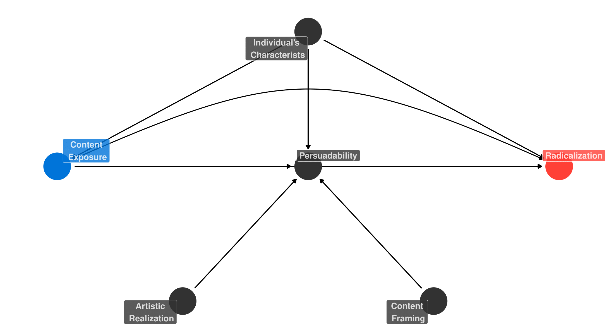

# Inhalt

## 1. Vorstellung D:Islam und Promotion
## 2. Narrative, Framings und Radikalisierung
## 3. Die Rolle von Sozialen Medien
## 4. TikTok und seine Besonderheiten
## 5. Geplante Forschung
## 6. Empirische Anhaltspunkte

```{r setup, include=FALSE}
options(htmltools.dir.version = FALSE, echo=FALSE, message=FALSE, warning=FALSE)
library("rjson")
library("tidyverse")
library("purrr")
library("lubridate")
library("readxl")
library("quanteda")
library("tidytext")
library("magrittr")
library("plotly")
library("ggpubr")
library("geomtextpath")
library("quanteda.textmodels")
library("quanteda.textplots")
library("quanteda.textstats")
library("kableExtra")

library(RefManageR)
BibOptions(
check.entries = FALSE, 
bib.style = "authoryear", 
cite.style = "authoryear", 
style = "markdown",
hyperlink = TRUE, 
dashed = FALSE,
max.names = 3L)
myBib = ReadBib("mybib_19042022.bib")
```


---
class: inverse, center, middle

# D:Islam Projekt

---

# Forschungsfragen

> Das Projekt D:Islam wird den Forschungsfragen nachgehen, ob
>+ muslimische Communities Bedrohungen durch Radikalisierungsvorhaben ausgesetzt sind und wie diese Bedrohungen sich gestalten;
+ ob und mit welchen Defense-Strategien sie darauf reagieren und
+ ob im Zuge der Reaktionen Hybridisierungsprozesse bei der Ausübung des islamischen Glaubens und der Auslebung einer muslimischen Identität erkennbar sind, die auf einen "Deutschen Islam" hindeuten?


--

**In meiner Arbeit:**

+ Welche kommunikativen Strategien werden online eingesetzt, um Zustimmung und Zugehörigkeit zu mobilisieren?
+ Genauer gesagt: welche Narrative, Frames und Darstellungen?
+ Wie wirken sich diese auf Konsument:innen aus?

---
class: inverse, center, middle

# Narrative, Framings und Radikalisierung
---

# Psychosoziale Dispositionen

**Relevante "Push" Faktoren, u.a.:**

--

+ `r Citet(myBib, "King2011602")`: Effekte der gruppenbezogenen Deprivation, Identitätskonflikte und Persönlichkeitsmerkmale

--

+ `r Citet(myBib, "McGilloway201539")`: Geschlecht und Alter

--

+ `r RefManageR::Citet(myBib, "Misiak201951_2")`: Hohe Prävalenz von psychotischen und/oder affektiven Störungen

--

+ `r Citet(myBib, "mccauley2008")`: Persönliche Viktimisierung und politische Missstände
+ `r Citet(myBib, "Emmelkamp2020")`: Wahrgenommene Diskriminierung, wahrgenommene Gruppenbedrohung, wahrgenommene prozedurale Ungerechtigkeit, wahrgenommene Illegitimität der Entscheidungsträger

---

# Radikalisierung als Überzeugung

--
.blockquote[`r RefManageR::Citet(myBib, "poletta2020")`: "The power of stories, this suggests, lies in their capacity to elicit empathy for the protagonist and, as a result, support for the larger cause (Bas & Grabe, 2016; Grabe et al., 2017)."]

--

.blockquote[`r RefManageR::Citet(myBib, "Hassan2018_2")`: "The reviewed studies provide tentative evidence that exposure to radical violent online material is associated with extremist online and offline attitudes, as well as the risk of committing political violence among white supremacist, neo-Nazi, and radical Islamist groups. Active seekers of violent radical material also seem to be at higher risk of engaging in political violence as compared to passive seekers. The Internet’s role thus seems to be one of decision-shaping, which, in association with offline factors, can be associated to decision-making"]

--

.blockquote[`r RefManageR::Citet(myBib, "doi:10.1177/1461444819879423")`: "We found that online propaganda and news media had interdependent influences on Islamists’ rejections of non-Muslims and Western politics, as well as on their willingness to use violence and commit suicide. Cognitively radicalized individuals were influenced by propaganda that blamed non-Muslims for opposing Islam; this was reinforced by online mainstream news reports of right-wing populism and extremism that propagandists selectively distributed via social media"]
---

# Eine Überzeugungsformel?

Aus bisheriger Distanizierungsarbeit, Literaturüberblick und Datenanalysen ist folgendes Muster zu beobachten:

--

1. Verweis auf Ereignisse und Tatsachen - meistens in Verbundenheit mit Missständen
2. Herstellung von Intersubjektivität durch geteilte Beobachtung
3. Anwendung von sprachlichen Codes zur Aktivierung impliziten - bzw. Expertenwissens
4. Überlagerung dieser Ereignisse und Tatsachen mit eigener Ideologie
5. **Vorstellung eines programmatischen Angebots um präsentierte Realitäten zu veränden**

--
+ Im Prinzip ein Marketing Modell
+ Aristotelische Triade der Appelle (Modes of persuasion): Ethos, Pathos, Logos

---
class: inverse, center, middle

# Soziale Medien und Radikalisierung

---

# Die Rolle von Sozialen Medien

--

+ Extremisten haben sich ins Internet abgewandert (z.B. `r Citet(myBib, c("conversi2012", "gill2017", "Solr-cronfa35706"))`)
+ Hoher Wirksamkeits-/Sicherheitskompromiss `r RefManageR::Citep(myBib, "MORSELLI2007143")` durch Anonymisierung und Pseudonymisierung
+ Recommender Systems
  + "Echo Chambers" und Filterblasen
  + Ideenvielfalt und Dogmatismus (vgl. `r Citet(myBib, c("Hunsberger1994", "kruglanski2014the", "Solr-cronfa35706", "Liht2013", "vassilis2002", "Strozier2010"))`)
+ Künstlerische Untermauerung durch Bilder, Videos und Musik (z.B. Anashid, siehe `r RefManageR::Citet(myBib, "pieslak1")`)
+ Volatile Zielgruppen aufgrund des Digital Divide (siehe `r Citet(myBib, c("Dimaggio2004355", "Hargittai2008602", "Hargittai2008239", "vanDeursen2014507"))`

---
# Tikok und seine Besonderheiten

--

+ Effektiver Recommender System mit arbiträrer Moderation (siehe `r RefManageR::Citet(myBib, "mm1")`)
+ Recommender System favorisiert populäre Accounts weniger stark (siehe `r RefManageR::Citet(myBib, "ZHANG2021846")`)
+ Dominanz der ForYouPage
+ Steigende Nutzer:innenzahlen, tendenziell jung (über die Hälfte unter 24)
+ Vereinfachtes Einsetzen von Video- und Tonmaterial

&rarr; **Verursacht TikTok eine "slippery slope" Radikalisierung?**


---

# Vorschlag eines Kausalmodells



---

class: inverse, center, middle

# Geplante Forschung

---

# Geplante Forschung

--

**Drei-stufiges Verfahren**

--

*Stufe 1*

+ **Wie verbeitet sind radikale Inhalte unter deutschen TikTok-Nutzer:innen?**
  + Analyse von TikTok-Nutzungsdaten durch Datenspenden
  + Gekoppelt an Survey zu demographischen, sozialen und kulturellen Eigenschaften
  + Auswertung von Text-, Video und Tonmaterials durch verschiedene Verfahren
  + Sample: TikTok-Nutzer:innen in Deutschland zwischen 16 und 24
  + **Ziel: Exploration typischer TikTok Inhalte und sequentielle Abfolgen. Assoziation zwischen demografischen Faktoren, individuellen Interessen und radikalen Inhalten.**

---

# Geplante Forschung

*Stufe 2*

+ **Welche Themen- bzw. Interessensbereiche assoziert der TikTok-Algorithmus mit radikalen Inhalten?**
  + Beobachtung aus erster Stufe nutzen um Hypothesen über Zusammenhänge zu generieren
  + Nutzung von TikTok seitens der Forscher:innen auf ein spezifisches Interessensfeld
  + Ebenfalls Auswertung von Text-, Video und Tonmaterials
  + **Ziel: Simulation von "Perceived Immutable Characteristics" (siehe `r Citet(myBib, "greiner11")`)**

---

# Geplante Forschung

*Stufe 3*

+ **Wie wirken sich radikale Inhalte auf ihre Konsument:innen aus**
  + Experimentelles Design
  + Nutzung radikaler Inhalter aus vorherigen Stufen
  + Inhalt, Volumen und Frequenz radikaler Inhalte als randomisierte Treatments
  + Anschließende pädagogische Intervention
  + **Ziel: Schätzen eines kausalen Effekts von Konsumption radikaler Inhalte auf TikTok auf Radikalisierung**

---

class: inverse, center, middle

# Empirische Anhaltspunkte

---

# Kampfsport und TikTok

--

```{r, message=FALSE, echo=FALSE, warning=FALSE}
df <- read_xlsx("video_list.xlsx")
df <- df[c(1:848),]

## DTM
corpus <- corpus(df, text_field = "comment")
dtm <- dfm(corpus)
dtm_df <- tidy(dtm)

df$document <- paste0("text", seq(1:848))
term_matrix <- left_join(dtm_df, select(df, date, link, document), by.x = "document")

term_matrix <- term_matrix[term_matrix$term != ";",]
term_matrix$Video <- as.numeric(gsub("text", "", term_matrix$document))

termss<- data.frame(table(term_matrix$term))

names(termss) <- c("Themen", "Häufigkeit")
termss <- termss[order(termss$Häufigkeit, decreasing = T),]

knitr::kable(termss) %>%
  kable_styling("striped", full_width = F) %>% 
 scroll_box(width = "800px", height = "500px")
```

---

# Kampfsport und TikTok

```{r, message=FALSE, echo=FALSE, warning=FALSE, fig.align='center', fig.height=7, fig.width=11}


first <- ggplot(term_matrix, aes(x = as.factor(Video), y = term, color = term, text = "")) +
  geom_point(size = 1, aes(text = paste('Video: ', Video,
                                        '<br>Subject: ', term))) +
  theme(axis.text.x = element_blank()) +
  guides(color="none") +
  xlab("Video Chronology") +
  ylab("") +
  theme(axis.text = element_text(size = 5))  

first <- ggplotly(first, tooltip = "text")

first <- first %>% layout(showlegend = FALSE)

first
```

---

# Religiös Begründet

```{r, message=FALSE, echo=FALSE, warning=FALSE, fig.width=10, fig.align='center'}
islm <- c("nasheed_ext", "rad_bezug")

islm_df <- term_matrix$document[grep(paste(islm, collapse="|"), term_matrix$term)]
islm_df <- term_matrix[term_matrix$document %in% islm_df,]

islm_df <- islm_df %>%
  mutate(to_highlight = case_when(
    term %in% islm~ 1L,
    TRUE ~ 0L
  ))

q <- ggplot(islm_df, aes(x = as.factor(Video), y = term, color = to_highlight, text = "")) +
  geom_point(aes(shape = as.factor(to_highlight), size=2, text = paste('Video: ', Video,
                                                                       '<br>Subject: ', term))) +
  # theme(axis.text.x = element_blank()) +
  guides(color="none", shape = "none", size = "none") +
  xlab("Video Chronology") +
  ylab("")

q <- ggplotly(q, tooltip = "text")

q <- q %>% layout(showlegend = FALSE)

q <- q %>%
  layout(hovermode = "x unified")

q
```

---

# Rechter Content

```{r, message=FALSE, echo=FALSE, warning=FALSE, fig.width=11, fig.align='center'}
rw <- c("wehrmacht", "turkish_nationalism", "right_wing", "misogyny", "anti_feminism", "greek_nationalism", "anti_ukraine")

rw_df <- term_matrix$document[grep(paste(rw, collapse="|"), term_matrix$term)]
rw_df <- term_matrix[term_matrix$document %in% rw_df,]

rw_df <- rw_df %>%
  mutate(to_highlight = case_when(
    term %in% rw ~ 1L,
    TRUE ~ 0L
  ))

p <- ggplot(rw_df, aes(x = as.factor(Video), y = term, color = to_highlight, text ="")) +
  geom_point(aes(shape = as.factor(to_highlight), size=2, text = paste('Video: ', Video,
                                                                       '<br>Subject: ', term))) +
  # theme(axis.text.x = element_blank()) +
  guides(color="none", shape = "none", size = "none") +
  xlab("Video Chronology") +
  ylab("")

p <- ggplotly(p, tooltip = "text")

p <- p %>% layout(showlegend = FALSE)
p <- p %>%
  layout(hovermode = "x unified")
p
```

---

# Kriminalität

```{r, message=FALSE, echo=FALSE, warning=FALSE, fig.width=12, fig.align='center'}
crim2 <- c("rocker", "organized_crime", "delinquency")

crim2_df <- term_matrix$document[grep(paste(crim2, collapse="|"), term_matrix$term)]
crim2_df <- term_matrix[term_matrix$document %in% crim2_df,]

crim2_df <- crim2_df %>%
  mutate(to_highlight = case_when(
    term %in% crim2~ 1L,
    TRUE ~ 0L
  ))

z2 <- ggplot(crim2_df, aes(x = as.factor(Video), y = term, color = to_highlight, text = "")) +
  geom_point(aes(shape = as.factor(to_highlight), size=2, text = paste('Video: ', Video,
                                                                       '<br>Subject: ', term))) +
  theme(axis.text.x = element_blank()) +
  guides(color="none", shape = "none", size = "none") +
  xlab("Video Chronology") +
  ylab("")

z2 <- ggplotly(z2, tooltip = "text")

z2 <- z2 %>% layout(showlegend = FALSE)

z2 <- z2 %>%
  layout(hovermode = "x unified")

z2
```

---

# Erotik

```{r, message=FALSE, echo=FALSE, warning=FALSE, fig.width=12, fig.align='center'}
porng <- c("eroticism", "pornography", "jail_baiting")

porng_df <- term_matrix$document[grep(paste(porng, collapse="|"), term_matrix$term)]
porng_df <- term_matrix[term_matrix$document %in% porng_df,]

porng_df <- porng_df %>%
  mutate(to_highlight = case_when(
    term %in% porng~ 1L,
    TRUE ~ 0L
  ))

prn <- ggplot(porng_df, aes(x = as.factor(Video), y = term, color = to_highlight, text = "")) +
  geom_point(aes(shape = as.factor(to_highlight), size=2, text = paste('Video: ', Video,
                                                                       '<br>Subject: ', term))) +
  theme(axis.text.x = element_blank()) +
  guides(color="none", shape = "none", size = "none") +
  xlab("Video Chronology") +
  ylab("")

prn <- ggplotly(prn, tooltip = "text")

prn <- prn %>% layout(showlegend = FALSE)

prn <- prn %>%
  layout(hovermode = "x unified")
prn

```

---


# Diktatoren

```{r, message=FALSE, echo=FALSE, warning=FALSE, fig.width=9, fig.align='center'}
dictator <- c("baath_bezug", "ramzan_kadyrov")

dictator_df <- term_matrix$document[grep(paste(dictator, collapse="|"), term_matrix$term)]
dictator_df <- term_matrix[term_matrix$document %in% dictator_df,]

dictator_df <- dictator_df %>%
  mutate(to_highlight = case_when(
    term %in% dictator~ 1L,
    TRUE ~ 0L
  ))

dict <- ggplot(dictator_df, aes(x = as.factor(Video), y = term, color = to_highlight, text = "")) +
  geom_point(aes(shape = as.factor(to_highlight), size=2, text = paste('Video: ', Video,
                                                                       '<br>Subject: ', term))) +
  # theme(axis.text.x = element_blank()) +
  guides(color="none", shape = "none", size = "none") +
  xlab("Video Chronology") +
  ylab("")

dict <- ggplotly(dict, tooltip = "text")

dict <- dict %>% layout(showlegend = FALSE)

dict <- dict %>%
  layout(hovermode = "x unified")
dict

```

---

# Case Study: Muslim Interaktiv

--

```{r, echo=FALSE, warning=FALSE, message=FALSE, fig.width=11}
mus_df <- read_excel("mus_data.xlsx")

mus_df$video_length <- format(mus_df$video_length , format="%H:%M:%S")
mus_df$video_length <- hms(mus_df$video_length)
mus_df$video_length <- as.duration(mus_df$video_length)

ts_g <- ggplot(mus_df, aes(x = video_date, y = video_likes, text= paste('Datum: ', video_date,
                                                                        '<br>Likes: ', video_likes,
                                                                        '<br>Länge: ', video_length))) +
  geom_point(aes(size = video_length), alpha = 1/2) +
  scale_size(range = c(0, 12)) +
  ylab("Likes") +
  xlab("Datum") +
  geom_vline(xintercept = as.numeric(as.POSIXct(as.Date("2021-9-4"))), 
             color = "aquamarine3", 
             lwd = 0.5, linetype=2)  +
  annotate("text", x = as.POSIXct(as.Date("2021-9-4")), y = 40000, size = 2, label = "Ann. 11.09.") +
  geom_vline(xintercept = as.numeric(as.POSIXct(as.Date("2021-7-1"))), 
             color = "aquamarine3", 
             lwd = 0.5, linetype=2)  +
  annotate("text", x = as.POSIXct(as.Date("2021-7-1")), y = 40000, size = 2, label = "Ann. Marwa El-Sherbini") +
  geom_vline(xintercept = as.numeric(as.POSIXct(as.Date("2021-3-10"))), 
             color = "aquamarine3", 
             lwd = 0.5, linetype=2)  +
  annotate("text", x = as.POSIXct(as.Date("2021-3-10")), y = 40000, size = 2, label = "Ann. Christchurch") +
  geom_vline(xintercept = as.numeric(as.POSIXct(as.Date("2021-3-27"))), 
             color = "aquamarine3", 
             lwd = 0.5, linetype=2)  +
  annotate("text", x = as.POSIXct(as.Date("2021-3-27")), y = 30000, size = 2, label = "Rassismus Polizei") +
  geom_vline(xintercept = as.numeric(as.POSIXct(as.Date("2021-5-23"))), 
             color = "aquamarine3", 
             lwd = 0.5, linetype=2)  +
  annotate("text", x = as.POSIXct(as.Date("2021-5-23")), y = 30000, size = 2, label = "C.Özdemir Araber Zitat") +
  geom_vline(xintercept = as.numeric(as.POSIXct(as.Date("2021-5-7"))), 
             color = "aquamarine3", 
             lwd = 0.5, linetype=2)  +
  annotate("text", x = as.POSIXct(as.Date("2021-5-7")), y = 40000, size = 2, label = "Bundesratbeschl. Kopftuch\nAl-Aqsa") +
  geom_vline(xintercept = as.numeric(as.POSIXct(as.Date("2021-7-28"))), 
             color = "aquamarine3", 
             lwd = 0.5, linetype=2)  +
  annotate("text", x = as.POSIXct(as.Date("2021-7-28")), y = 30000, size = 2, label = "S.Kurz Bild Interview") +
  geom_vline(xintercept = as.numeric(as.POSIXct(as.Date("2021-2-17"))), 
             color = "aquamarine3", 
             lwd = 0.5, linetype=2)  +
  annotate("text", x = as.POSIXct(as.Date("2021-2-17")), y = 30000, size = 2, label = "Ann. Hanau") +
  geom_vline(xintercept = as.numeric(as.POSIXct(as.Date("2021-10-22"))), 
             color = "aquamarine3", 
             lwd = 0.5, linetype=2)  +
  annotate("text", x = as.POSIXct(as.Date("2021-10-22")), y = 30000, size = 2, label = "Bild Adhan") +
  guides(size=guide_legend(title="Video Length")) +
  theme_light()

ts_g <- ggplotly(ts_g, tooltip = "text")

ts_g <- ts_g %>%
  layout(hovermode = "x unified")

ts_g
```

---

# Case Study: Muslim Interaktiv


```{r, message=FALSE, warning=FALSE, echo=FALSE, fig.width=11}
library(Rtsne)
embedding_matrix <- readRDS("embedding_matrix")

set.seed(2022)
tsne <- Rtsne(embedding_matrix[2:500,], perplexity = 50, pca = FALSE)
set.seed(2022)
tsne_plot <- tsne$Y %>%
  as.data.frame() %>%
  mutate(word = row.names(embedding_matrix)[2:500]) %>%
  ggplot(aes(x = V1, y = V2, label = word)) + 
  geom_text(size = 3)

library(plotly)
ggplotly(tsne_plot)
```

---

# Case Study: Muslim Interaktiv

```{r, echo=FALSE, warning=FALSE, message=FALSE, fig.align='center'}
subj <- mus_df[,c(21:24)]
names(subj) <- c("Islamophobia", "War", "Violence", "Hijab")
subj_long <- subj %>% pivot_longer(everything(), names_to = "subject", values_to = "count")
subj_long <- subj_long[subj_long$count == 1,]

subj_sum <- subj_long %>%
  group_by(subject) %>%
  summarise(percent = round((sum(count)/87)*100))

subj_sum$percent_text <- paste(subj_sum$percent, "%", sep = " ")

ggplot(subj_sum, aes(y = percent, x = reorder(subject, percent))) +
  geom_col() +
  coord_flip() +
  theme_bw() +
  ylab("Prozent der Texte") +
  xlab("Themen") +
  geom_text(aes(label = percent_text), hjust = 1.5, color = "white")
```

---

class: inverse, center, middle

# Vielen Dank!

---

# Literatur

```{r, results='asis', echo=FALSE, warning=FALSE}
PrintBibliography(myBib, start=1, end=4)
```

---

# Literatur

```{r, results='asis', echo=FALSE, warning=FALSE}
PrintBibliography(myBib, start=5, end=8)
```

---

# Literatur

```{r, results='asis', echo=FALSE, warning=FALSE}
PrintBibliography(myBib, start=9, end=12)
```
---

# Literatur

```{r, results='asis', echo=FALSE, warning=FALSE}
PrintBibliography(myBib, start=13, end=16)
```

---

# Literatur

```{r, results='asis', echo=FALSE, warning=FALSE}
PrintBibliography(myBib, start=20, end=24)
```
